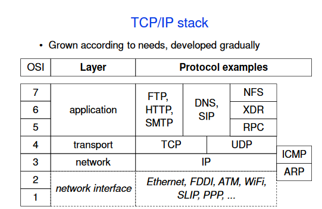

# 2. slajdy

<!-- # Layered architecture
### recorder layer
writes data in specified format, hands data to secretary
### secretary layer
takes the data and prepares their sending format
### registry layer
chooses how to deliver
### advantages
- modularity
- saved resources -->

## Síťový model
- počet vrstev a jejich struktura
- úkony vrstev
- ISO OSI (Open Systems Interconnection model od International Organization for Standardization)
## Síťová architektura
- přidání konkrétních služeb
- protokoly mezi vrcholy
- např. TCP/IP
## Open systems interconnection
- základní referenční model a množina protokolů
- model dobrý, architektura nepraktická
### L1 fyzická vrstva
řeší fyzické aspekty přenosu (proud, délka vodiče)
### L2 data link vrstva
provádí transfer dat mezi přímo spojenými nody
### L3 síťová vrstva
posílání mezi nepřímo spojenými nody
### L4 transportní vrstva
umí přiřazovat proudy dat ke komunikačním kanálům, někdy segmentace dat a garance úspěšného přenosu
### L5 session/relační vrstva
synchronizace dialogu mezi relačními vrstvami
### L6 prezentační vrstva
transformace dat do tvaru, který používají aplikace
### L7 aplikační vrstva
poskytuje aplikacím přístup ke komunikačnímu systému

### Standardy 
- X.400 email inspirovaný poštovními adresami
- X.500 (Directory Access Protocol)
- Nepříliš implementované, velmi složité
- X.509 - public keys v asymetrické kryptografii (nutnost unikátnosti identifikátorů klíčů)
- LDAP, zjednodušený DAP

## connection-oriented services
- phone call
- order important
- reliable packet delivery
## connectionless services
- mail
- order nor deliveri is guaranteed

## nevim
- Mac address -data link layer 6 bytes
- IP address - network layer
- domain address - application layer

## DNS
- TLDs
    - cz
- SLDs and lower lever - administered by owner

# ip address
- IPv4 - 4 bytes
- IPv6 - 16 bytes

- public addresses - assigned by ISP
- private address block (unreachable outside of LAN, more security)
    - router must use NAT (Network address translation)
- static x dynamic addressing, free x restricted connection
- link-local - chosen by the host software
    - communication only in directly connected network

# port
- 16b number
- client can ask server for generic port number
- 2 channels between 2 computers must have 2 ports
- same port can be used for different channels if they have different transport layer protocol
- destination port < 1024
- web servers 80
- 21 FTP (file transfer protocol)
- 22 SSH (secure shell)
- 25 SMTP (simple mail transfer protocol)
- 53 DNS (domain name system)
- 80,443 HTTP,HTTPS (hypertext transfer protocol)
- 5060,5061 SIP (session initiation protocol)(VoIP) 
# socket
- IP+port

# NAT
- router at the perimeter of private network modifies addresses so that server can respond to it and then routes the response to client
# URI
- html links
- URI = scheme:// authority \[path\] ?query #fragment
- authority = login :password @address :port
# 35 read original
# multiplexing
- many channels at one layer use one at an lower layer
    - PDU (protocol data unit) - data and control info
    - IDU (interface data unit) - communication between layers, one gives PDU and the lower responds with success/failiure
    - PDUs have a body and header -> encapsulation, (not necesairly between layers f.e. IPv4->IPv6)
## PDU types
- application L - messages(connectionless) or stream(connection-oriented)
- transport L - TCP has to add header to each packet for reassembly and ports (src,dest,offest), UDP just adds port
- network L -  packet, checks if can be delivered directly, or finds next hop-node. Passes to data-link with destination node address
- data link L - frame: prepends packet with dest and src MAC addresses and network protocol number. Suffix-frame check sequence. Finally passes to physical layer

- then inverse process of checking and routing data to correct place (FCS check, MAC address verification, decapsulation, IP check, UDP just pass to application/TCP reconstruct segment)
# 36-37???