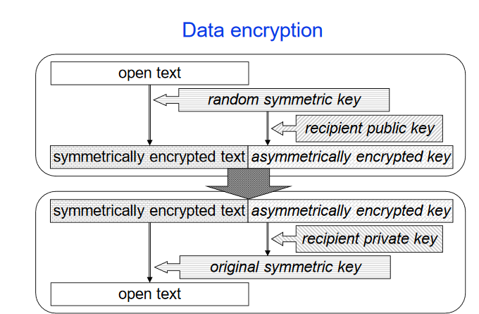
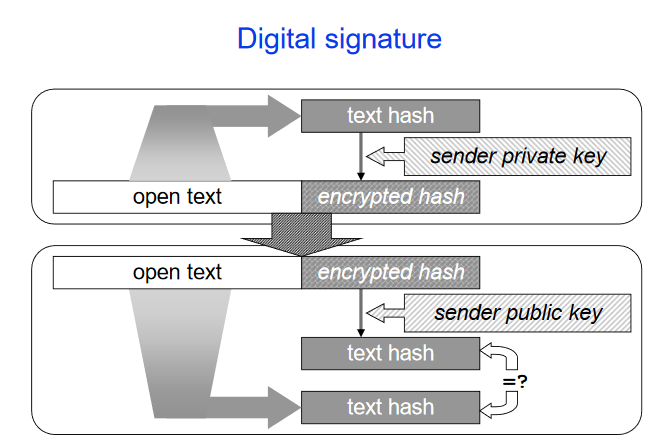
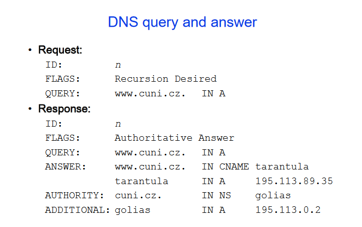

- authentication - identity verification
- authorization - defining set of services for authenticated user
### methods of proving identity
- knowledge (PIN, password)
- possession (Key, token)
- biometrics (fingerprint)
### features of remote authentication
- risk of eavesdropping 
    - solution: one time password, cryptography for secure channel
- extending protocols SASL(Simpole authentication and security layer)
- centralised authentication 
    - authentication server (identity provider)
### one time password
- offline list of OTPs
- challenge-response
- synchronised authentication token

### symmetric cryptography
- examples: DES, Blowfish, AES, RC4
- fast
### asymmetric cryptography
- multiplication vs factoring, discrete log
- examples: RSA, DSA
- slow
- issue: public key must be verified

### hash functions
- examples: (CRC, MD5,) SHA

### data encryption

### Diffie-Hellman algorithm
1. Alice picks secret number a and public primes p,q
2. Alice computes $A=p^a$ mod q, sends p,q,A to Bob

3. Bob picks secret number b, computes $B=p^b$ mod q sends B to Alice

4. Alice computes $s=B^a$ mod q and Bob the same $s=A^b$ mod q
- without knowing a and b when choosing big p,q, computing s is hard

### public key authentication
- web of trust (PGP)
- certification authority (CA)
### certificate
- key with owner ID tag issued by CA
- if we trust CA we can trust key (chain of trust)

### SSL, TLS
- between transport and application layer
- for many protocols
1. client requests SSL connection+parameters
2. server responds with parameters and own certificate
3. client verifies server generates key basis encrypts by server public key and sends back
4. server decrypts key basis, using the basis both client and server generate keys
5. now both can encrypt by this key

## application layer in tcp/ip
- covers OSI layers 5,6,7
    - communication rules between client and server
    - dialog status
    - data interpretation
- defines:
    - dialog control flow (who starts, what can be requested, what can be responses)
    - message format (text, binary data, struct)
    - message type (request, response)
    - message fields semantics (descriptions)
    - transport layer interaction (depends on TCP/UDP)

### DNS
- resolving domain names to addresses
- resource record
    - name
    - ttl
    - type and data
- EDNS - bigger allowed UDP chunks
- binary protocol
- client queries known servers until obtaining answer
    - increasing timeouts
#### DNS resuorce records
- SOA - start of authority, initial record, general domain attributes
- NS - domain nameserver name, usually more than one
- A - host IPv4 for given name
- AAAA - host IPv6 for given name
- PTR - reverse record
- CNAME - alias creation (alias name | canonical name)
- MX (Mail eXchanger) - which server receives mail for given domain/computer

### DNS servers
- primary: manages domain RR database
- secondary: backups, download contents of primary database
- caching 
- p and s are authority servers

### DNS security
- cache poisioning attack
- DNSSEC - signing all recoreds with key stored in parent domain
    - very complex
### tools
- nslookup - we can query servers and resolve names
- dig (UNIX)
